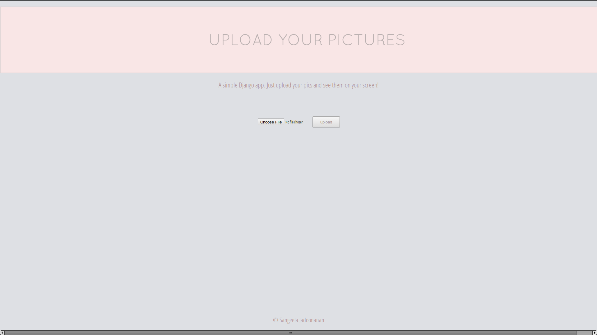
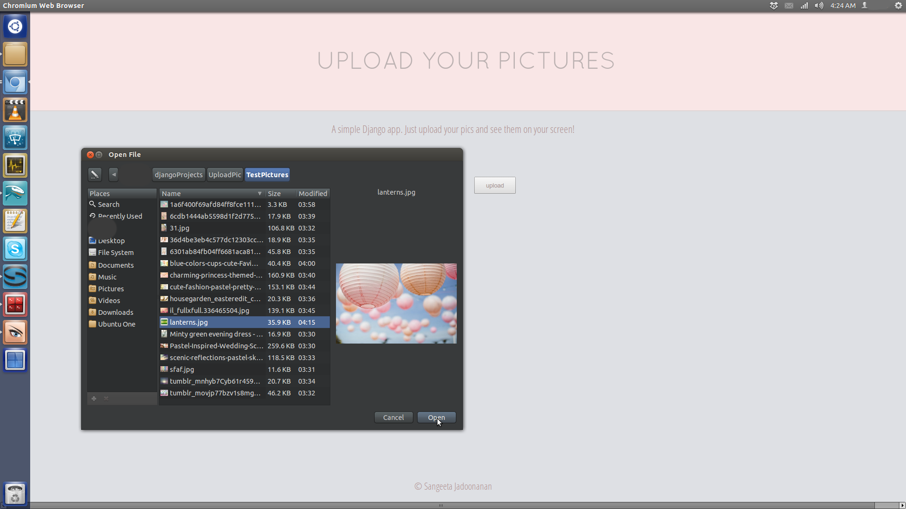
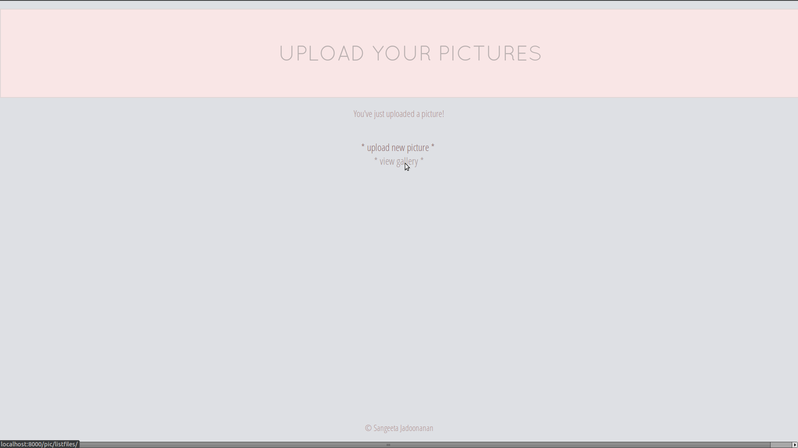
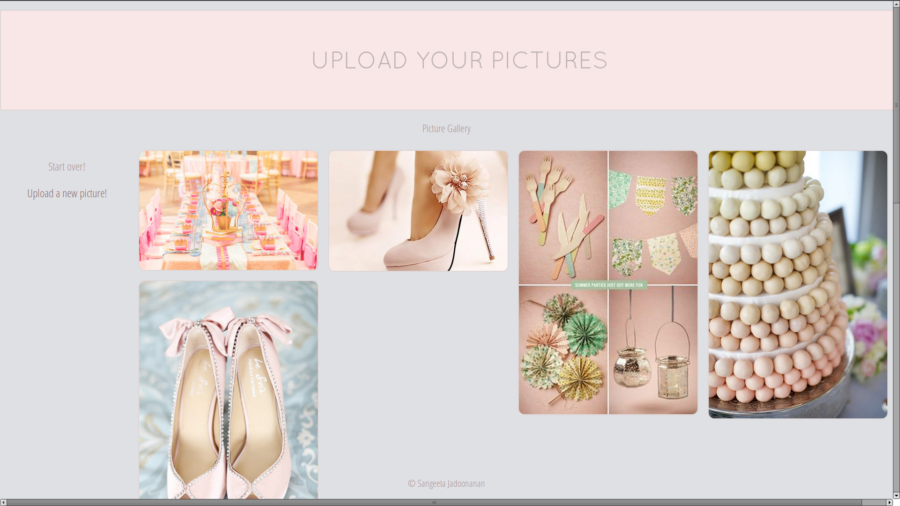

Django-Photo-App
================

### A Django app that allows user to upload pictures and view them. 

###### Core of this project was serving user uploaded (static media) files.

### Some screenshots. 

###### The upload/home page.

###### Selecting a picture to upload.

###### After upload, choose to upload another picture or view gallery.

###### Viewing the gallery after some uploads.

